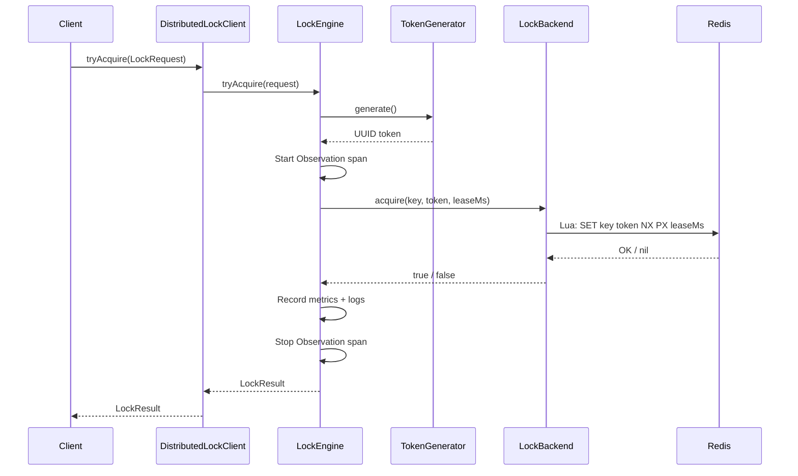
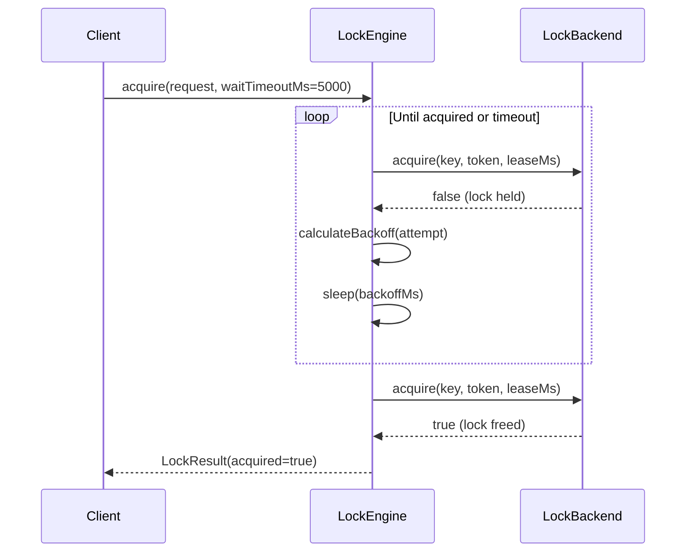
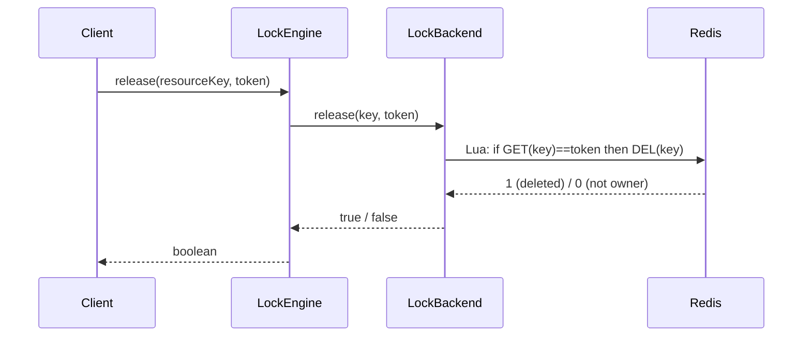

# Architecture

## Component Overview

```
┌────────────────────────────────────────────────────────────────┐
│                     Spring Boot Application                     │
│                                                                 │
│  ┌─────────────────────┐                                        │
│  │ DistributedLockClient│─────────────────────────┐             │
│  │  (Public API)       │                         │             │
│  └──────────┬──────────┘                         │             │
│             │                                     │             │
│  ┌──────────▼──────────┐  ┌──────────────┐  ┌───▼───────────┐ │
│  │    LockEngine       │─▶│ LockBackend  │─▶│ Redis / Memory │ │
│  │  (Orchestrator)     │  │ (Interface)  │  │               │ │
│  └──────────┬──────────┘  └──────────────┘  └───────────────┘ │
│             │                                                   │
│  ┌──────────┼──────────────────────────┐                       │
│  │          │                          │                       │
│  ▼          ▼                          ▼                       │
│ TokenGen   LockMetrics          ObservationRegistry            │
│ (UUID)     (Micrometer)         (Tracing Spans)                │
└────────────────────────────────────────────────────────────────┘
```

### Component Responsibilities

| Component | Responsibility |
|---|---|
| **DistributedLockClient** | Public API facade. Provides `tryAcquire`, `acquire`, `renew`, `release`, and `executeWithLock`. Ensures lock release in finally block for `executeWithLock`. |
| **LockEngine** | Orchestrates acquisition with exponential backoff and jitter. Manages tracing spans (Micrometer Observation), structured logging with hashed resource keys, and metrics recording. Resolves `defaultLeaseMs` and `ownerId` from configuration. |
| **LockBackend** | Abstract interface for storage. Defines atomic `acquire`, `release`, `renew` contract with ownership semantics. |
| **RedisLockBackend** | Executes Lua scripts for atomic operations. Wrapped in Resilience4j circuit breaker (50% failure threshold, 10s open state). |
| **InMemoryLockBackend** | ConcurrentHashMap-based storage with TTL expiration. Scheduled cleanup every 60s. For dev/test only. |
| **TokenGenerator** | UUID-based unique token generation for lock ownership. |
| **LockMetrics** | Prometheus instrumentation with low-cardinality labels (`operation`, `result`, `backend`). |
| **DistributedLockAutoConfiguration** | Spring Boot auto-configuration. Conditional beans with `@ConditionalOnMissingBean` for consumer overrides. |

## Sequence Diagrams

### Acquire Flow



### Acquire with Timeout



### Release Flow



## Data Flow

### Lock State Machine

```
                   ┌─────────────────────────────────┐
                   │                                 │
                   ▼                                 │
              ┌─────────┐    acquire     ┌──────────┤
              │  FREE   │──────────────▶│  HELD    │
              └─────────┘               │          │
                   ▲                    │  owner:  │
                   │                    │  token   │
                   │     release        │  lease:  │
                   ├────────────────────│  TTL ms  │
                   │                    │          │
                   │     lease expiry   └────┬─────┘
                   └────────────────────────│
                                            │ renew
                                            └──▶ HELD (new TTL)
```

### Redis Key Lifecycle

```
Time: T+0
  ├── acquire:  SET lock:job:daily-settlement {token} NX PX 30000
  │             → Key created with 30s TTL

Time: T+20s
  ├── renew:    if GET == token → PEXPIRE 30000
  │             → TTL reset to 30s from now

Time: T+45s
  ├── release:  if GET == token → DEL
  │             → Key removed immediately

  OR

Time: T+30s (no renew)
  └── expiry:   Redis auto-deletes key
                → Lock is FREE for new acquisition
```

## Failure Semantics

### Circuit Breaker (Resilience4j)

```
CLOSED ──────▶ OPEN ──────▶ HALF_OPEN
(normal)      (50% fail)    (after 10s)
   ▲              │              │
   │              │              │
   └──────────────┴──── probe ───┘
                  succeeds
```

| State | Behavior |
|---|---|
| **CLOSED** | All Redis calls go through normally |
| **OPEN** | Redis calls short-circuit to fail-closed (or fail-open if configured) |
| **HALF_OPEN** | 3 probe calls allowed; if successful, circuit closes |

Configuration:
- Failure rate threshold: 50%
- Minimum calls before evaluation: 5
- Sliding window size: 10 calls
- Wait duration in open state: 10 seconds

### Backend Failure Handling

| Mode | Behavior |
|---|---|
| **Fail-closed** (default) | Acquisition returns `false`. Lock is **not** assumed acquired. |
| **Fail-open** | Acquisition returns `false`. Warning logged. Error metric incremented. |

In both modes, backend errors never propagate as unhandled exceptions.

## Deployment Topology

### Local Development

```
┌──────────┐
│   App    │
│ (memory) │
└──────────┘
```

No external dependencies. Locks are process-local.

### Single Instance + Redis

```
┌──────────┐     ┌───────┐
│   App    │────▶│ Redis │
│ (redis)  │     │       │
└──────────┘     └───────┘
```

### Multi-Instance Production

```
                    ┌──────────┐
            ┌──────▶│ App #1   │──────┐
            │       └──────────┘      │
┌────────┐  │       ┌──────────┐      │    ┌───────┐
│  Load  │──┼──────▶│ App #2   │──────┼───▶│ Redis │
│Balancer│  │       └──────────┘      │    │       │
└────────┘  │       ┌──────────┐      │    └───────┘
            └──────▶│ App #3   │──────┘
                    └──────────┘

All instances share Redis → global lock enforcement
```

## Extensibility

| Extension Point | Interface / Mechanism |
|---|---|
| New backends | `LockBackend` implementation (e.g., SQL, etcd) |
| Custom tokens | `TokenGenerator` override (e.g., ULID) |
| Custom metrics | `LockMetrics` override via `@ConditionalOnMissingBean` |
| Configuration | `DistributedLockProperties` with full YAML binding |
